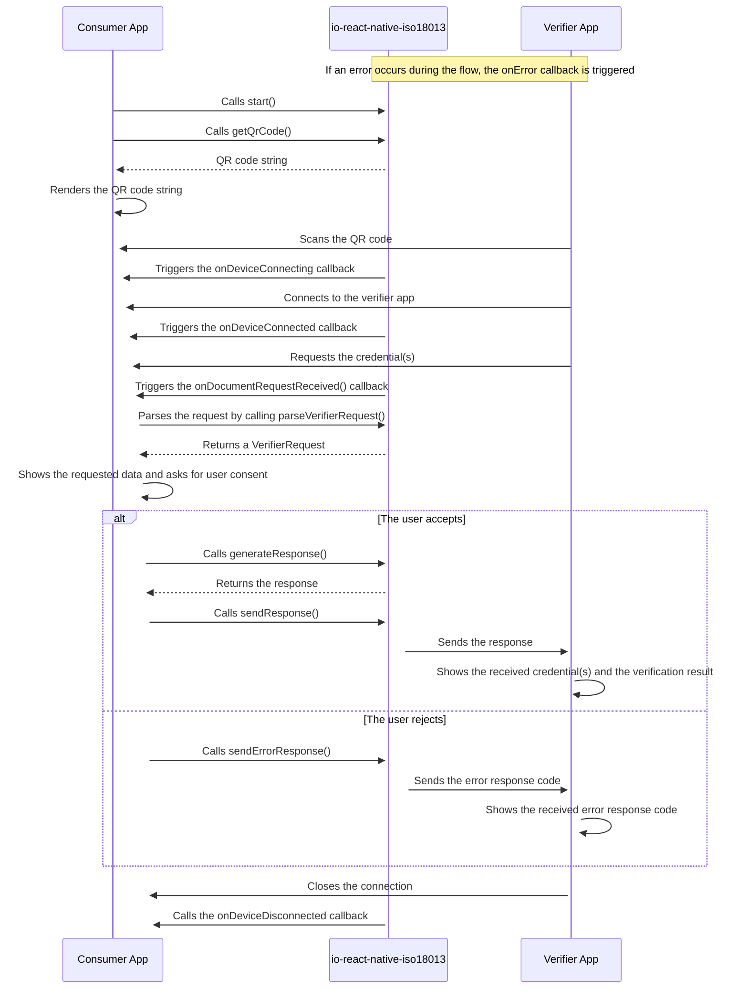

# ISO18013-5

This library provides a React Native module based on [iso18013-android](https://github.com/pagopa/iso18013-android) and [iso18013-ios](https://github.com/pagopa/iso18013-ios) which allows mDL proximity presentation according to the
ISO 18013-5 standard and remote presentation according to the ISO 18013-7 standard.

## Installation

## Usage

### `events`

This library emits the following events:
| Event | Payload | Description |
|---------------------------|--------------------------------|----------------------------------------------------------------------------------------------------------------------------------------------|
| onDeviceConnecting (iOS only) | `undefined` | Event dispatched when the verifier app is connecting |
| onDeviceConnected | `undefined` | Event dispatched when the verifier app is connected. |
| onDocumentRequestReceived | `{ data: string } \| undefined` | Event dispatched when the consumer app receives a new request, contained in the data payload. It can be parsed via the `parseVerifierRequest` provided [here](src/schema.ts). |
| onDeviceDisconnected | `undefined` | Event dispatched when the verifier app disconnects. |
| onError | `{ error: string } \| undefined` | Event dispatched when an error occurs which is contained in the error payload. It can be parsed via the `parseError` provided [here](src/schema.ts). |

Listeners can be added using the `addListener` method and removed using the `removeListener` method.

```typescript
import { ISO18013_5 } from '@pagopa/io-react-native-iso18013';

ISO18013_5.addListener('event', () => console.log('event occurred'));

ISO18013_5.removeListener('event');
```

#### `onDeviceConnecting`

```typescript
import { ISO18013_5 } from '@pagopa/io-react-native-iso18013';

ISO18013_5.addListener('onDeviceConnecting', () => {
  console.log('Device is connecting');
});
```

#### `onDeviceConnected`

```typescript
import { ISO18013_5 } from '@pagopa/io-react-native-iso18013';

ISO18013_5.addListener('onDeviceConnected', () => {
  console.log('Device is connected');
});
```

#### `onDocumentRequestReceived`

```typescript
import { ISO18013_5 } from '@pagopa/io-react-native-iso18013';

ISO18013_5.addListener(
  'onDocumentRequestReceived',
  (payload: ISO18013_5.EventsPayload['onDocumentRequestReceived']) => {
    console.log('onDocumentRequestReceived', payload);
    if (!payload || !payload.data) {
      console.warn('Request does not contain a message.');
      return;
    }

    // Parse and verify the received request with the exposed function
    const parsedJson = JSON.parse(payload.data);
    console.log('Parsed JSON:', parsedJson);
    const parsedResponse = parseVerifierRequest(parsedJson);
    console.log('Parsed response:', JSON.stringify(parsedResponse));
  }
);
```

#### `onDeviceDisconnected`

```typescript
import { ISO18013_5 } from '@pagopa/io-react-native-iso18013';

ISO18013_5.addListener('onDeviceDisconnected', () => {
  console.log('Device is disconnected');
});
```

#### `onError`

```typescript
import { ISO18013_5 } from '@pagopa/io-react-native-iso18013';

ISO18013_5.addListener(
  'onError',
  async (data: ISO18013_5.EventsPayload['onError']) => {
    try {
      if (!data || !data.error) {
        throw new Error('No error data received');
      }
      const parsedError = parseError(data.error);
      console.error(`onError: ${parsedError}`);
    } catch (e) {
      console.error('Error parsing onError data:', e);
    } finally {
      // Close the flow on error
      await closeFlow();
    }
  }
);
```

### `start`

Starts the proximity flow and starts the bluetooth service. This method also accepts optional parameters to configure the initialization on Android, along with the possibility
to specify a certificates of array to verify the reader app.

```typescript
import { ISO18013_5 } from '@pagopa/io-react-native-iso18013';

await ISO18013_5.start();
```

### `getQrCodeString`

Returns the QR code string which contains a base64url encoded CBOR object which encodes the bluetooth engagement data.
It can be used to display the QR code in the UI which will be scanned by the verifier app.

```typescript
import { ISO18013_5 } from '@pagopa/io-react-native-iso18013';

const qrCodeString = await ISO18013_5.getQrCodeString();
console.log(qrCodeString);
```

### `generateResponse`

Generates a response that will be sent to the verifier app containing the requested documents.

```typescript
import { ISO18013_5 } from '@pagopa/io-react-native-iso18013';

const response = await ISO18013_5.generateResponse({
  documents: [
    {
      type: 'mDL',
      data: 'base64url-encoded-data',
    },
  ],
});
console.log(response);
```

### `sendResponse`

Sends the response generate by `generateResponse` to the verifier app.

```typescript
import { ISO18013_5 } from '@pagopa/io-react-native-iso18013';

await ISO18013_5.sendResponse(response);
```

### `sendErrorResponse`

Sends an error response to the verifier app. The supported error codes are defined in the Table 20 of the ISO 18013-5 standard and are coded in the `ErrorCode` enum.

```typescript
import { ISO18013_5, ErrorCode } from '@pagopa/io-react-native-iso18013';

await ISO18013_5.sendErrorResponse({
  errorCode: ErrorCode.SESSION_ENCRYPTION,
  errorMessage: 'An error occurred while encrypting the session',
});
```

### `close`

Closes the QR engagement by releasing the resources allocated during the `start` method.
Before starting a new flow, it is necessary to call this method to ensure that the previous flow is properly closed.
The listeners can be removed using the `removeListener` method.

```typescript
import { ISO18013_5 } from '@pagopa/io-react-native-iso18013';

await ISO18013_5.close();
```

## Proximity Flow Schema

This section describes a high level overview of the interactions between an app implementing the `io-react-native-proximity` library and a verifier app.



## Errors

This table contains the list of error codes that can be thrown by the `ISO18013_5` module which are mapped via the `ModuleErrorCodes` type:

| Type                      | Platform    | Description                                                                  |
| ------------------------- | ----------- | ---------------------------------------------------------------------------- |
| DRH_NOT_DEFINED           | Android     | The device retrieval helper hasn't been initialized, call the `start` method |
| QR_ENGAGEMENT_NOT_DEFINED | Android     | The QR engagement hasn't been initialized, call the `start` method           |
| START_ERROR               | Android/iOS | An error occurred while initializing the required resources                  |
| GET_QR_CODE_ERROR         | Android/iOS | An error occurred while generating the engagement QR code                    |
| SEND_RESPONSE_ERROR       | Android/iOS | An error occurred while sending the response for the verifier app            |
| SEND_ERROR_RESPONSE_ERROR | Android/iOS | An error occurred while sending the error response to the verifier app       |
| GENERATE_RESPONSE_ERROR   | Android/iOS | An error occurred while generating the response for the verifier app         |
| CLOSE_ERROR               | Android     | An error occured while closing the required resources                        |
| EUNSPECIFIED              | Android     | Default error when no other error is specified                               |

An error can be parsed using the `ModuleErrorSchema` with type `ModuleErrorCodes` exposed by the `ISO18013_5` module. The error can be parsed as follows:

```typescript
import { ISO18013_5 } from '@pagopa/io-react-native-iso18013';
try {
  await ISO18013_5.func();
} catch (error) {
  const parsedError = ISO18013_5.ModuleErrorSchema.parse(error); // Or ModuleErrorSchema.safeParse(error) for safe parsing
  console.log(JSON.stringify(parsedError, null, 2));
}
```

The parsed object will contain properties from both iOS and Android platforms:

```typescript
{
  code: string; // Defined in ModuleErrorCodes
  message: string;
  name: string;
  userInfo?: Record<string, any> | null;
  nativeStackAndroid?: Array<{
    lineNumber: number;
    file: string;
    methodName: string;
    class: string;
  }>;
  domain?: string;
  nativeStackIOS?: Array<string>;
};
```
