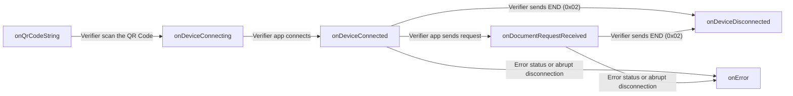
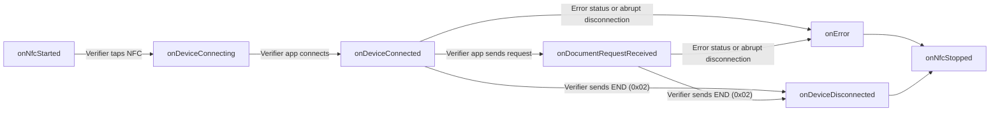
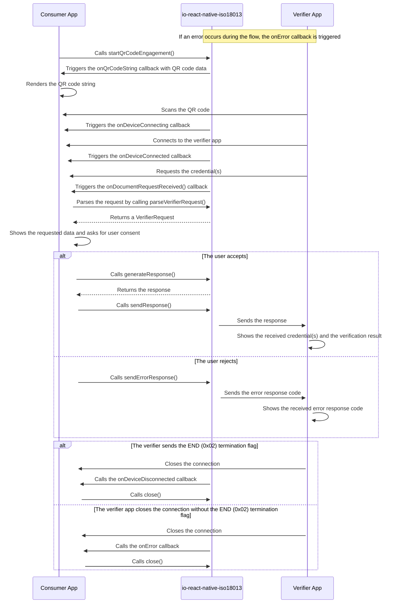

# ISO18013-5

This library provides a React Native module based on [iso18013-android](https://github.com/pagopa/iso18013-android) and [iso18013-ios](https://github.com/pagopa/iso18013-ios) which allows mDL proximity presentation according to the ISO 18013-5 standard.

## Installation

```
yarn add @pagopa/io-react-native-iso18013
cd ios && bundle exec pod install && cd ..
```

## Permission

This library uses Bluetooth capabilities in order to implement the proximity flow defined in the ISO 18013-5 standard. Thus, Bluetooth permissions must be added to the native projects.

### Android

Add the following permissions to your `AndroidManifest.xml`:

```xml
<!-- Required for Bluetooth on Android >=12 or SDK >=31 -->

<!-- We defined the neverForLocation flag as we do not derive it from the Bluetooth -->
<uses-permission android:name="android.permission.BLUETOOTH_SCAN" android:usesPermissionFlags="neverForLocation"/>
<uses-permission android:name="android.permission.BLUETOOTH_CONNECT" />
<uses-permission android:name="android.permission.BLUETOOTH_ADVERTISE" />

<!-- Required for Bluetooth on Android <=11 SDK <= 30 -->
<uses-permission android:name="android.permission.BLUETOOTH"
                  android:maxSdkVersion="30" />
<uses-permission android:name="android.permission.BLUETOOTH_ADMIN"
                  android:maxSdkVersion="30" />
<uses-permission android:name="android.permission.ACCESS_FINE_LOCATION" android:maxSdkVersion="30"/>
```

Please note that the `neverForLocation` flag of `BLUETOOTH_SCAN` indicates that the app does not derive location information from Bluetooth scans. However, you still need to include the `ACCESS_FINE_LOCATION` permission for Android versions <=11 (SDK <=30) to enable Bluetooth scanning.

### iOS

Add the following keys to your `Info.plist`:

```xml
<!-- Required for Bluetooth usage -->
<key>NSBluetoothAlwaysUsageDescription</key>
<string>$(PRODUCT_NAME) needs access BLE.</string>
<key>NSBluetoothPeripheralUsageDescription</key>
<string>$(PRODUCT_NAME) needs access BLE.</string>
<key>NSBluetoothScanUsageDescription</key>
<string>$(PRODUCT_NAME) needs access to scan for nearby Bluetooth devices.</string>
```

More info can be found in the [official Android documentation](https://developer.android.com/develop/connectivity/bluetooth/bt-permissions).

## Events

This library emits the following events:
| Event | Payload | Description |
|---------------------------|---------------------------------------------------------------------------|----------------------------------------------------------------------------------------------------------------------------------------------|
| onQrCodeString | `{ data: string }` | Event dispatched when the QR Code payload is generated. Contains the QR code string to display. |
| onNfcStarted | `undefined` | Event dispatched when NFC starts successfully. |
| onNfcStopped | `undefined` | Event dispatched when NFC stops successfully. |
| onDeviceConnecting | `undefined` | Event dispatched when the verifier app is connecting (iOS only). |
| onDeviceConnected | `undefined` | Event dispatched when the verifier app is connected. |
| onDocumentRequestReceived | `{ data: string; retrievalMethod: RetrievalMethod }` | Event dispatched when the consumer app receives a new request. The `data` payload can be parsed via the `parseVerifierRequest` function. The `retrievalMethod` indicates whether BLE or NFC was used. |
| onDeviceDisconnected | `undefined` | Event dispatched when the verifier app disconnects by sending the END (0x02) flag. |
| onError | `{ error?: string } \| undefined` | Event dispatched when an error occurs which is contained in the error payload. It can be parsed with `ISO18013_5.OnErrorPayloadSchema`. |

Where `RetrievalMethod` is defined as `'ble' | 'nfc'`.

### QR Code engagement flow

The events flow for QR Code engagement is described in the following diagram:


```mermaid
flowchart LR
    onQrCodeString["onQrCodeString"]
    onDeviceConnecting["onDeviceConnecting"]
    onDeviceConnected["onDeviceConnected"]
    onDocumentRequestReceived["onDocumentRequestReceived"]
    onDeviceDisconnected["onDeviceDisconnected"]
    onError["onError"]

    onQrCodeString -- "Verifier scan the QR Code" --> onDeviceConnecting
    onDeviceConnecting -- "Verifier app connects" --> onDeviceConnected

    onDeviceConnected -- "Verifier app sends request" --> onDocumentRequestReceived
    onDeviceConnected -- "Verifier sends END (0x02)" --> onDeviceDisconnected
    onDeviceConnected -- "Error status or abrupt disconnection" --> onError

    onDocumentRequestReceived -- "Verifier sends END (0x02)" --> onDeviceDisconnected
    onDocumentRequestReceived -- "Error status or abrupt disconnection" --> onError
```

### NFC engagement flow

The events flow for NFC engagement is described in the following diagram:


```mermaid
flowchart LR
    onNfcStarted["onNfcStarted"]
    onNfcStopped["onNfcStopped"]
    onDeviceConnecting["onDeviceConnecting"]
    onDeviceConnected["onDeviceConnected"]
    onDocumentRequestReceived["onDocumentRequestReceived"]
    onDeviceDisconnected["onDeviceDisconnected"]
    onError["onError"]

    onNfcStarted -- "Verifier taps NFC" --> onDeviceConnecting
    onDeviceConnecting -- "Verifier app connects" --> onDeviceConnected

    onDeviceConnected -- "Verifier app sends request" --> onDocumentRequestReceived
    onDeviceConnected -- "Verifier sends END (0x02)" --> onDeviceDisconnected
    onDeviceConnected -- "Error status or abrupt disconnection" --> onError

    onDocumentRequestReceived -- "Verifier sends END (0x02)" --> onDeviceDisconnected
    onDocumentRequestReceived -- "Error status or abrupt disconnection" --> onError

    onError --> onNfcStopped
    onDeviceDisconnected --> onNfcStopped
```

### Listen for events

Listeners can be added using the `addListener` method and removed by using the returned reference by calling the `remove` method.

```typescript
import { ISO18013_5 } from '@pagopa/io-react-native-iso18013';

const listener = ISO18013_5.addListener('event', () =>
  console.log('event occurred')
);

listener.remove();
```

#### `onQrCodeString`

```typescript
import { ISO18013_5 } from '@pagopa/io-react-native-iso18013';

ISO18013_5.addListener(
  'onQrCodeString',
  (payload: ISO18013_5.EventsPayload['onQrCodeString']) => {
    console.log('QR Code payload received: ', payload.data);
  }
);
```

#### `onNfcStarted`

```typescript
import { ISO18013_5 } from '@pagopa/io-react-native-iso18013';

ISO18013_5.addListener('onNfcStarted', () => {
  console.log('NFC started and ready for engagement');
});
```

#### `onNfcStopped`

```typescript
import { ISO18013_5 } from '@pagopa/io-react-native-iso18013';

ISO18013_5.addListener('onNfcStopped', () => {
  console.log('NFC stopped');
});
```

#### `onDeviceConnecting`

```typescript
import { ISO18013_5 } from '@pagopa/io-react-native-iso18013';

ISO18013_5.addListener('onDeviceConnecting', () => {
  console.log('Device is connecting');
});
```

#### `onDeviceConnected`

```typescript
import { ISO18013_5 } from '@pagopa/io-react-native-iso18013';

ISO18013_5.addListener('onDeviceConnected', () => {
  console.log('Device is connected');
});
```

#### `onDocumentRequestReceived`

```typescript
import { ISO18013_5 } from '@pagopa/io-react-native-iso18013';

ISO18013_5.addListener(
  'onDocumentRequestReceived',
  (payload: ISO18013_5.EventsPayload['onDocumentRequestReceived']) => {
    console.log('onDocumentRequestReceived', payload);
    if (!payload || !payload.data) {
      console.warn('Request does not contain a message.');
      return;
    }

    // Parse and verify the received request with the exposed function
    const parsedJson = JSON.parse(payload.data);
    console.log('Parsed JSON:', parsedJson);
    const parsedResponse = parseVerifierRequest(parsedJson);
    console.log('Parsed response:', JSON.stringify(parsedResponse));
  }
);
```

#### `onDeviceDisconnected`

```typescript
import { ISO18013_5 } from '@pagopa/io-react-native-iso18013';

ISO18013_5.addListener('onDeviceDisconnected', () => {
  console.log('Device is disconnected');
});
```

#### `onError`

```typescript
import { ISO18013_5 } from '@pagopa/io-react-native-iso18013';

ISO18013_5.addListener(
  'onError',
  async (data: ISO18013_5.EventsPayload['onError']) => {
    try {
      if (!data || !data.error) {
        throw new Error('No error data received');
      }
      const parsedError = ISO18013_5.OnErrorPayloadSchema.parse(data.error);
      console.error(`onError: ${parsedError}`);
    } catch (e) {
      console.error('Error parsing onError data:', e);
    } finally {
      // Close the flow on error
      await ISO18013_5.close();
    }
  }
);
```

## Methods

#### `startQrCodeEngagement`

Starts the proximity flow and starts the bluetooth service for QR Code engagement. This method accepts an optional configuration object.

| Parameter           | Platform    | Default | Description                                                                                                               |
| ------------------- | ----------- | ------- | ------------------------------------------------------------------------------------------------------------------------- |
| `peripheralMode`    | Android     | `true`  | Whether the device is in peripheral mode                                                                                  |
| `centralClientMode` | Android     | `false` | Whether the device is in central client mode                                                                              |
| `clearBleCache`     | Android     | `true`  | Whether the BLE cache should be cleared                                                                                   |
| `certificates`      | Android/iOS | `[]`    | Two-dimensional array of base64 strings representing DER encoded X.509 certificates used to authenticate the verifier app |

```typescript
import { ISO18013_5 } from '@pagopa/io-react-native-iso18013';

await ISO18013_5.startQrCodeEngagement();

// With optional configuration
await ISO18013_5.startQrCodeEngagement({
  peripheralMode: true,
  centralClientMode: false,
  clearBleCache: true,
  certificates: [['base64DerCert1', 'base64DerCert2']],
});
```

#### `startNfcEngagement`

Starts NFC engagement (HCE) so a verifier can initiate the proximity flow by tapping phones.
On iOS, requires iOS 17.4 or later.
On Android, requires HCE support (most mid-to-high-end devices).
This method accepts an optional configuration object.

| Parameter           | Platform    | Default   | Description                                                                                                               |
| ------------------- | ----------- | --------- | ------------------------------------------------------------------------------------------------------------------------- |
| `peripheralMode`    | Android     | `true`    | Whether the device is in peripheral mode                                                                                  |
| `centralClientMode` | Android     | `false`   | Whether the device is in central client mode                                                                              |
| `clearBleCache`     | Android     | `true`    | Whether the BLE cache should be cleared                                                                                   |
| `certificates`      | Android/iOS | `[]`      | Two-dimensional array of base64 strings representing DER encoded X.509 certificates used to authenticate the verifier app |
| `retrievalMethods`  | Android/iOS | `['ble']` | Array of supported retrieval methods (`'ble'` and/or `'nfc'`)                                                             |

```typescript
import { ISO18013_5 } from '@pagopa/io-react-native-iso18013';

await ISO18013_5.startNfcEngagement();

// With optional configuration
await ISO18013_5.startNfcEngagement({
  peripheralMode: true,
  centralClientMode: false,
  clearBleCache: true,
  certificates: [['base64DerCert1']],
  retrievalMethods: ['ble', 'nfc'],
});
```

#### `generateResponse`

Generates a response that will be sent to the verifier app containing the requested documents.

```typescript
import { ISO18013_5 } from '@pagopa/io-react-native-iso18013';

const documents = [
  {
    issuerSignedContent: 'base64url-or-base64-encoded-content',
    alias: 'key-alias',
    docType: 'docType',
  },
];

const acceptedFields = {
  'org.iso.18013.5.1.mDL': {
    'org.iso.18013.5.1': {
      hair_colour: true,
      given_name_national_character: true,
      family_name_national_character: true,
      given_name: true,
    },
  },
};

const response = await ISO18013_5.generateResponse(documents, acceptedFields);
console.log(response);
```

#### `sendResponse`

Sends the response generate by `generateResponse` to the verifier app.

```typescript
import { ISO18013_5 } from '@pagopa/io-react-native-iso18013';

await ISO18013_5.sendResponse(response);
```

#### `sendErrorResponse`

Sends an error response to the verifier app. The supported error codes are defined in the Table 20 of the ISO 18013-5 standard and are coded in the `ErrorCode` enum.

```typescript
import { ISO18013_5 } from '@pagopa/io-react-native-iso18013';

await ISO18013_5.sendErrorResponse(ISO18013_5.ErrorCode.SESSION_ENCRYPTION);
```

#### `close`

Closes the QR/NFC engagement by releasing the bluetooth connection and clearing any allocated resources.
Before starting a new flow, it is necessary to call this method to ensure that the previous flow is properly closed.

```typescript
import { ISO18013_5 } from '@pagopa/io-react-native-iso18013';

await ISO18013_5.close();
```

## Proximity Sequence Diagram

This section describes a high level overview of the happy flow interactions between an app implementing the `io-react-native-iso18013` library and a verifier app.


```mermaid
sequenceDiagram
    participant app as Consumer App
    participant proximity as io-react-native-iso18013
    participant verifier as Verifier App

    Note over proximity, verifier: If an error occurs during the flow, the onError callback is triggered
    app->>+proximity: Calls startQrCodeEngagement()
    proximity->>+app: Triggers the onQrCodeString callback with QR code data
    app->>+app: Renders the QR code string
    verifier->>+app: Scans the QR code
    proximity->>+app: Triggers the onDeviceConnecting callback
    verifier->>+app: Connects to the verifier app
    proximity->>+app: Triggers the onDeviceConnected callback
    verifier->>+app: Requests the credential(s)
    proximity->>+app: Triggers the onDocumentRequestReceived() callback
    app->>+proximity: Parses the request by calling parseVerifierRequest()
    proximity-->>+app: Returns a VerifierRequest
    app->>+app: Shows the requested data and asks for user consent
    alt The user accepts
        app->>+proximity: Calls generateResponse()
        proximity-->>+app: Returns the response
        app->>+proximity: Calls sendResponse()
        proximity->>+verifier: Sends the response
        verifier->>+verifier: Shows the received credential(s) and the verification result
    else The user rejects
        app->>+proximity: Calls sendErrorResponse()
        proximity->>+verifier: Sends the error response code
        verifier->>+verifier: Shows the received error response code
    end
    alt The verifier sends the END (0x02) termination flag
      verifier->>+app: Closes the connection
      proximity->>+app: Calls the onDeviceDisconnected callback
      app->>+proximity: Calls close()
    else The verifier app closes the connection without the END (0x02) termination flag
      verifier->>+app: Closes the connection
      proximity->>+app: Calls the onError callback
      app->>+proximity: Calls close()
    end
```

## Errors

This table contains the list of error codes that can be thrown by the `ISO18013_5` module which are mapped via the `ModuleErrorCodes` type:

| Type                      | Platform    | Description                                                            |
| ------------------------- | ----------- | ---------------------------------------------------------------------- |
| DRH_NOT_DEFINED           | Android     | The device retrieval helper hasn't been initialized                    |
| START_ERROR               | Android/iOS | An error occurred while starting the engagement                        |
| SEND_RESPONSE_ERROR       | Android/iOS | An error occurred while sending the response for the verifier app      |
| SEND_ERROR_RESPONSE_ERROR | Android/iOS | An error occurred while sending the error response to the verifier app |
| GENERATE_RESPONSE_ERROR   | Android/iOS | An error occurred while generating the response for the verifier app   |
| CLOSE_ERROR               | Android     | An error occurred while closing the required resources                 |
| EUNSPECIFIED              | Android     | Default error when no other error is specified                         |

An error can be parsed using the `ModuleErrorSchema` with type `ModuleErrorCodes` exposed by the `ISO18013_5` module. The error can be parsed as follows:

```typescript
import { ISO18013_5 } from '@pagopa/io-react-native-iso18013';
try {
  await ISO18013_5.func();
} catch (error) {
  const parsedError = ISO18013_5.ModuleErrorSchema.parse(error); // Or ModuleErrorSchema.safeParse(error) for safe parsing
  console.log(JSON.stringify(parsedError, null, 2));
}
```

The parsed object will contain properties from both iOS and Android platforms:

```typescript
{
  code: string; // Defined in ModuleErrorCodes
  message: string;
  name: string;
  userInfo?: Record<string, any> | null;
  nativeStackAndroid?: Array<{
    lineNumber: number;
    file: string;
    methodName: string;
    class: string;
  }>;
  domain?: string;
  nativeStackIOS?: Array<string>;
};
```
